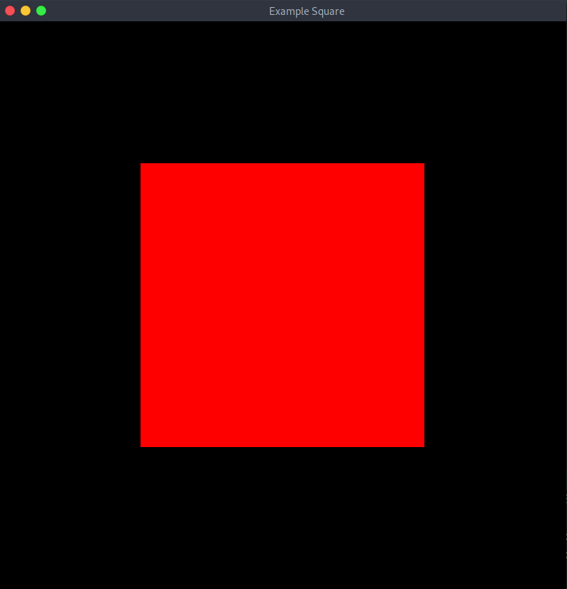

# Mokka

# Building
## Dependencies
 - CMake
 - Internet Connection Or Pre-downloaded SubModules


## Process

See [build options](#Build-Options) for how to enable/disable these features.<br>
<br>
Running the following command in the source directory will build the project
```bash
cmake -S . -B build
```
More specifically this will get/update submodules. Then build the files into shared libraries and move them to `Mokka/Natives/libs`. <br>
<br>
Build files will be placed into the specified directory in this case build. <br>
<br>
To build these files `cd` into the build folder then run the command `make`. <br>
<br>
To manually build a jar the mokka lib must be in the `Mokka/Natives/libs` folder. Jars can be build automatically with the [MOKKA_BUILD_JAR](#MOKKA_BUILD_JAR) option. <br>
e.g. 
```bash
cmake -DMOKKA_BUILD_JAR=ON -S . -B build
```
Building the files like before will produce a jar file called libmokka.jar.

## Build Options 
### MOKKA_GIT_SUBMODULE
Automatically gets/updates submodules when building. <br>
<br>
Useful if you don't want to manually build libs. Needed if both submodule and lib files don't already exist <br>
<br>
Not Windows Compatible <br>
<br>
Default: ON

### MOKKA_BUILD_DEPENDS
Automatically builds libs from required submodules. <br>
<br>
Useful if you don't want to manually build libs. Needed if lib files don't already exist. <br>
<br>
To use manually built libs place them into Mokka/Natives/libs (may not exist) <br>
<br>
Not windows compatible <br>
<br>
Default: ON

### MOKKA_BUILD_JAR
Creates a jar file with the compiled code. <br>
<br>
All libs must be built, automatically or manually, and java must be installed. <br>
<br>
To use manually built libs place them and the built mokka library file into Mokka/Natives/libs (may not exist) <br>
<br>
Not windows compatible <br>
<br>
Default: OFF <br>
<br>

# How to Use

## Initial Setup
Any Mokka project must have a public init function which will be called once when the program runs. <br>
<br>
There must also be a public run function which will be called every frame. <br>
<br>
To start Mokka call the Mokka.init function with width, height, and a window title within a main Function. <br>
<br>

## Creating Shapes 
Shapes are created like any other object in java. To be drawn they need to be assigned a material. <br>
<br>
There are three builtin materials BasicColor, BasicTexture, and BasicRainbow. <br>
<br>
BasicColor takes in a color object and will be drawn as the set color. The color can changed with the setColor method <br>
<br>
BasicRainbow is similar to BasicColor but with no arguments. Every time it's drawn it's color will automatically change by a small random amount. <br>
<br>
BasicTexture takes a texture object and it will be drawn with the set texture. The texture can be change with the setTexture method. <br>
<br>

## Drawing Shapes
Shapes can be drawn in run with the draw function <br>
e.g. if you have a shape object called shape
```Java
shape.draw();
```


# Examples

## Basic Red Square
### Code

```Java
package Examples;

import Mokka.*;
import Mokka.Shape.*;

public class Basic {
    static Rect square;

    public static void init() {
        Material red = new Material.BasicColor(new Color(1, 0, 0, 1));

        square = new Rect(0, 0, 0.5f, 0.5f);

        square.setMaterial(red);
    }

    public static void run() {

        square.draw();

    }

    public static void main(String[] args) {
        Mokka.init(800, 800, "Example Square");
    }
}
```
### Output <br>

<br>
<br>